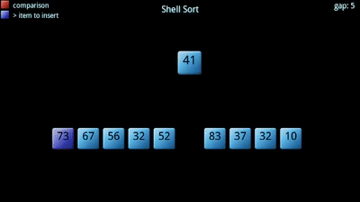
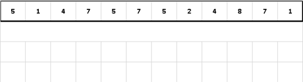

# JavaScript Algorithms
## 1. Bubble Sort

 

```javascript
function bubbleSort(arrayForSort) {
    var n = arrayForSort.length;
    for (var i = 0; i < n - 1; i++) {
        for (var j = 0; j < n - 1; j++) {
            if (arrayForSort[j] > arrayForSort[j + 1]) {
                var temp = arrayForSort[j];
                arrayForSort[j] = arrayForSort[j + 1];
                arrayForSort[j + 1] = temp;
            }
        }
    }
    return arrayForSort;
}
```

## 2. Selection Sort


```javascript
function selectionSort(arrayForSort) {
    var n = arrayForSort.length;
    for (var i = 0; i < n; i++) {
        var min = i;
        for (var j = i; j < n; j++) {
            if (arrayForSort[j] < arrayForSort[min]) {
                min = j;
            }
        }
        var temp = arrayForSort[min];
        arrayForSort[min] = arrayForSort[i];
        arrayForSort[i] = temp;
    }
    return arrayForSort;
}
```

## 3. Insertion Sort


```javascript
function insertionSort(arrayForSort) {
    var n = arrayForSort.length;
    for (var i = 0; i < n; i++) {
        var v = arrayForSort[i], j = i - 1;
        while (j >= 0 && arrayForSort[j] > v) { arrayForSort[j + 1] = arrayForSort[j]; j--; }
        arrayForSort[j + 1] = v;
    }
    return arrayForSort;
  }
```

## 4. Shell Sort



```javascript
function shellSort(arrayForSort)
{
    var n = arrayForSort.length, i = Math.floor(n/2);
    while (i > 0)
     { for (var j = 0; j < n; j++)
        { var k = j, t = arrayForSort[j];
          while (k >= i && arrayForSort[k-i] > t)
           { arrayForSort[k] = arrayForSort[k-i]; k -= i; }
           arrayForSort[k] = t;
        }
      i = (i==2) ? 1 : Math.floor(i*5/11);
     }
    return arrayForSort;
}
```

## 5. Counting Sort



```javascript
function countingSort(arrayForSort)
{   
    var n = arrayForSort.length, Count = [], B = [];
    for (var i = 0; i < n; i++) Count[ i ] = 0;
    for (var i = 0; i < n-1; i++)
     { for (var j = i+1; j < n; j++)
        { if (arrayForSort[ i ] < arrayForSort[j]) Count[j]++;
          else Count[ i ]++;
        }
     }
    for (var i = 0; i < n; i++) B[Count[ i ]] = arrayForSort[ i ];
    return B;
}
```